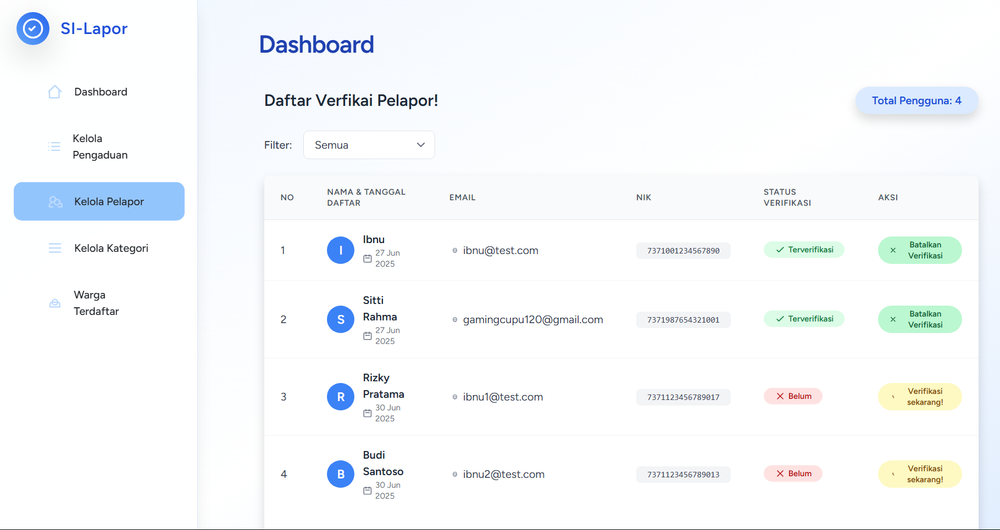

## SI-Lapor

**SI-Lapor** adalah aplikasi web modern berbasis Laravel yang dirancang untuk memudahkan proses pelaporan masyarakat dan manajemen data secara efisien di lingkungan kelurahan. Dengan fitur lengkap dan antarmuka intuitif, SI-Lapor membantu admin dan warga berkolaborasi dalam menangani pengaduan secara transparan dan terstruktur.

### Fitur Utama

- **Sistem Pelaporan Terintegrasi:** Warga dapat membuat, memantau, dan mengelola pengaduan dengan mudah.
- **Manajemen Data Terstruktur:** Data pengaduan, tanggapan, dan komentar tersimpan rapi dan aman.
- **Antarmuka Modern:** Menggunakan Laravel Breeze dan Tailwind untuk tampilan responsif dan user-friendly.
- **Keamanan Data:** Otentikasi, role-based access, dan verifikasi user untuk menjaga privasi dan integritas data.
- **Multi-User & Multi-Level Akses:** Mendukung peran admin dan user dengan hak akses berbeda.

Dokumentasi ini membahas fitur, instalasi, penggunaan, serta panduan pengembangan SI-Lapor. Ikuti setiap langkah agar aplikasi berjalan optimal.

---

## Teknologi yang Digunakan

- **Backend:** Laravel 12.x
- **Frontend:** Laravel Breeze (Blade), Tailwind CSS
- **Database:** MySQL
- **Authentication:** Laravel Breeze + Role-based Access
- **Library:** Laravel Eloquent, Middleware, Validator

---

## Instalasi & Setup Project

### Prasyarat

- PHP >= 8.2.x
- Composer
- MySQL
- Node.js & npm

### Langkah Instalasi

1. **Clone Repository**
    ```bash
    git clone https://github.com/username/si-lapor.git
    cd si-lapor
    ```

2. **Install Dependencies**
    ```bash
    composer install
    npm install
    ```

3. **Copy File Environment**
    ```bash
    cp .env.example .env
    ```

4. **Konfigurasi Database**
    Edit file `.env` dan sesuaikan konfigurasi database:
    ```
    DB_DATABASE=si_lapor
    DB_USERNAME=root
    DB_PASSWORD=
    ```

5. **Generate Key & Migrate**
    ```bash
    php artisan key:generate
    php artisan migrate --seed
    ```

6. **Build Asset Frontend**
    ```bash
    npm run dev
    ```

7. **Jalankan Server**
    ```bash
    php artisan serve
    ```

---

## Screenshot Project

<div align="center">

<table>
    <tr>
        <td align="center" valign="top">
            <br/>
            <b>Halaman User/Warga</b>
        </td>
        <td align="center" valign="top">
            <br/>
            <b>Dashboard Admin</b>
        </td>
    </tr>
</table>
</table>

</div>

---
## Struktur Database & Relasi

Visualisasi ERD:

<div align="">


</div>

> Untuk detail relasi, klik gambar untuk memperbesar (jika didukung oleh platform).

---

| No | Nama Tabel                | Deskripsi                                         | Atribut Penting / Relasi                                                                 |
|:--:|--------------------------|---------------------------------------------------|------------------------------------------------------------------------------------------|
| 1  | **users**                 | Data akun pengguna (admin & user).                | name, email, password, nik, role, is_verified.<br><em>Relasi:</em> 1 user → banyak pengaduan, komentar, tanggapan. |
| 2  | **warga_terdaftar**       | Referensi validasi NIK warga saat registrasi.     | nik, alamat, kelurahan.<br><em>Hanya validasi, tidak terhubung langsung.</em>            |
| 3  | **pengaduans**            | Data inti pengaduan masyarakat.                   | judul, isi, gambar, status.<br><em>Relasi:</em> 1 user, 1 kategori, banyak lampiran, komentar, tanggapan. |
| 4  | **kategori_pengaduans**   | Daftar kategori pengaduan (jalan rusak, lampu mati, dll). | <em>Relasi:</em> 1 kategori → banyak pengaduan.                                   |
| 5  | **tanggapans**            | Respons admin terhadap pengaduan.                 | <em>Relasi:</em> 1 tanggapan → 1 pengaduan, 1 admin.                                   |
| 6  | **komentar**              | Komentar user/admin pada pengaduan.               | <em>Relasi:</em> 1 user → banyak komentar, 1 pengaduan → banyak komentar.               |
| 7  | **lampiran_pengaduan**    | File tambahan pada pengaduan.                     | file, keterangan.<br><em>Relasi:</em> 1 pengaduan → banyak lampiran.                    |

---

## Fitur yang Sudah Dibangun

---

| Fitur                | Deskripsi Singkat                                                                                   |
|----------------------|----------------------------------------------------------------------------------------------------|
| 🔐 **Autentikasi & Registrasi** | Login/register dengan Laravel Breeze, validasi NIK, role-based access, auto login, middleware verifikasi. |
| 👤 **Manajemen Pengguna**        | Admin: verifikasi user, filter status. User: edit profil sendiri.                        |
| 📢 **Pengaduan Masyarakat**      | User: CRUD pengaduan, upload lampiran, lihat pengaduan sendiri. Admin: filter, ubah status, beri tanggapan. |
| 🗂️ **Kategori Pengaduan**        | CRUD kategori (admin), user pilih kategori, filter pengaduan.                            |
| 📎 **Lampiran Pengaduan**        | Upload multi-file, lampiran tampil di detail pengaduan.                                  |
| 💬 **Komentar pada Pengaduan**   | User & admin bisa komentar dan balas komentar.                                           |
| 🛠️ **Tanggapan Admin**           | Admin beri tanggapan (1 pengaduan = 1 tanggapan), tampil di detail pengaduan.            |
| 📊 **Dashboard Admin (Coming Soon)** | Statistik user & pengaduan, grafik tren bulanan.                                    |

---

## Cache & Optimasi

Jika terjadi perubahan konfigurasi atau error, jalankan perintah berikut untuk membersihkan cache:

```bash
php artisan route:clear
php artisan config:clear
php artisan cache:clear
php artisan view:clear
php artisan optimize:clear
```

---

**SI-Lapor** siap digunakan untuk mendukung transparansi dan efisiensi pelaporan masyarakat. Untuk pengembangan lebih lanjut, silakan cek dokumentasi kode dan kontribusi di repository!

[def]: ss-detail-pengaduan.png
